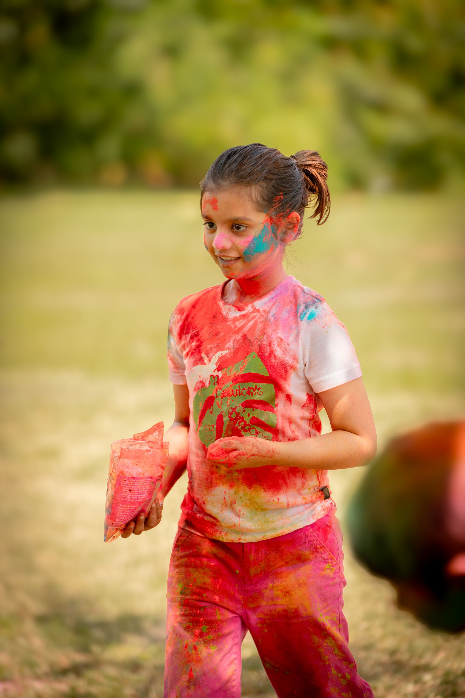
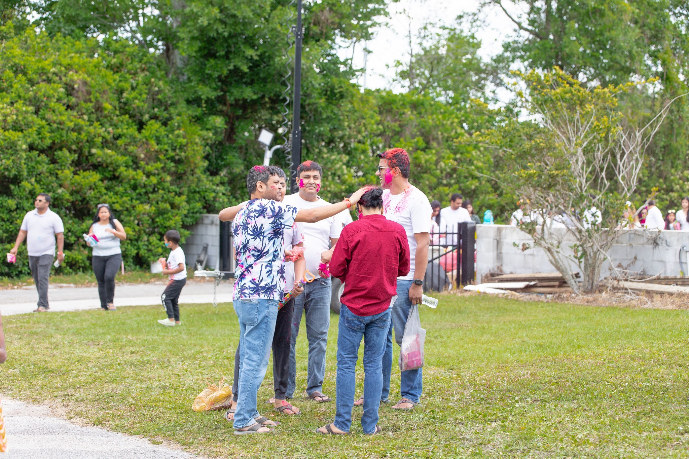
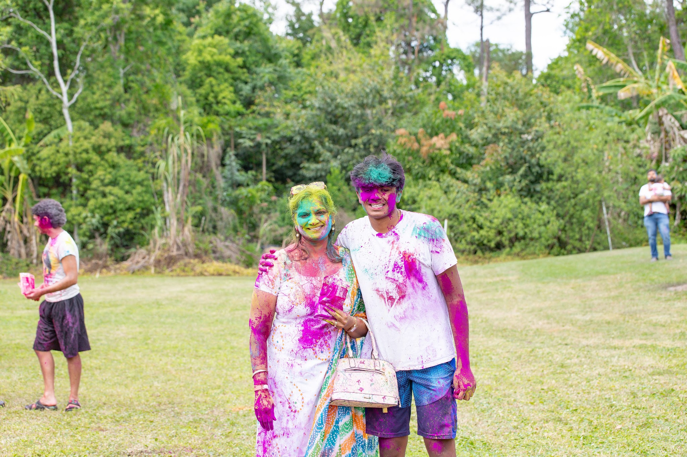

Holi brings the temple community together for a joyful celebration of color, music, and the arrival of spring. The evening before, the temple observes Holika Dahan with a bonfire marking the victory of devotion over evil.

Hundreds of families gather on the temple grounds for a morning of color, laughter, and community, sending everyone home in every shade of the rainbow.

Whatever your age or background, everyone is welcome to join in, throw a little color, and celebrate the arrival of spring together.

