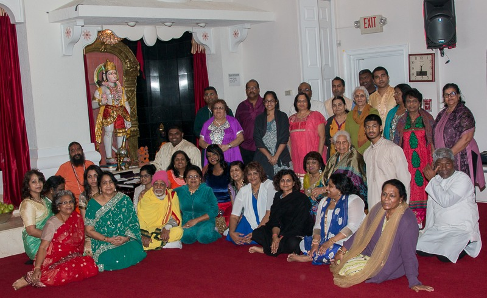

Shri Shiv Dham Hindu Temple is the spiritual home of the Hindu community in and around Orlando, a place to worship, to study, and to gather for the festivals that mark the Hindu calendar year. The congregation reflects the international character of Central Florida's Hindu diaspora, and the temple welcomes anyone seeking a quiet, sacred space on their own spiritual path.

## Our History

The temple's land was donated in 2001 by disciple Mohini Lakraj and family. Before ground was broken, Gurudev Brahmrishi Swami Vishvatma Bawra Ji Maharaj, founder of the Brahmrishi Mission, walked the property with Swami Chidghanand Parivrajak to bless the site.

Construction finished in 2002, and the temple opened with a single lingam alongside yoga and meditation classes taught by Swami Chidghanand Parivrajak. A Shiva murti was installed the following year, and the temple's grand opening was celebrated during Mahashivratri in 2003. Murtis of Ganeshji, Mataji Durga, and the Navagraha followed as the congregation grew.

Community support later funded altars for Hanumanji and, after that, Radha-Krishna, bringing the temple to the seven deities enshrined here today. In 2016, the temple began housing resident priests and started planning further expansion of the grounds and facilities.

**See it come to life:** nine years of faith, family, and community at Shri Shiv Dham.

  <button type="button" class="group absolute inset-0 block h-full w-full cursor-pointer" aria-label="Play video: Inside Shravan Mela: 9 Years of Faith, Family &amp; Community at Shri Shiv Dham">
    
    
    Inside Shravan Mela: 9 Years of Faith, Family &amp; Community at Shri Shiv Dham
    
      <svg viewBox="0 0 24 24" width="28" height="28" fill="currentColor" aria-hidden="true" class="ml-1"><path d="M8 5.14v13.72a1 1 0 0 0 1.5.86l11.04-6.86a1 1 0 0 0 0-1.72L9.5 4.28A1 1 0 0 0 8 5.14Z" /></svg>
    
  </button>

## Beyond Worship

Alongside daily puja and festival celebrations, the temple runs a youth program, yoga classes, and study of the Vedas and the Bhagavad Gita. See [Programs](/programs/) for the full schedule of ongoing classes.

## Visit Us

The temple is located at 460 Oberry Hoover Rd, Orlando, FL 32825. See [Directions](/directions-to-our-temple/) for parking and access details, or [Contact Us](/contact-us/) to reach the temple office directly.
