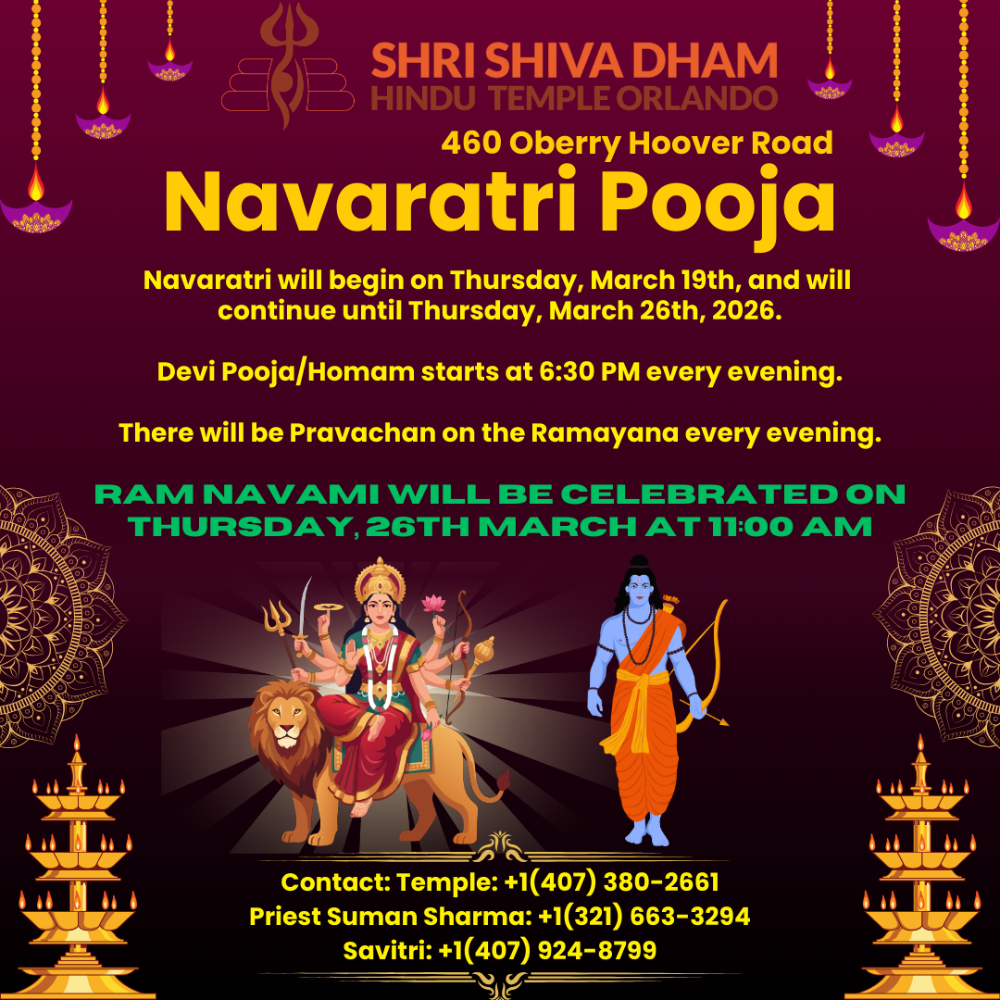

Navaratri is one of the temple's largest annual celebrations, nine nights of worship honoring the divine feminine. Sponsoring part of the celebration is a way to directly support the festival while dedicating that day's offering to your family's intention.

## Sponsorship Options

- **Daily Prasad** — sponsor the offering shared with devotees on a given night
- **Aarti** — sponsor the evening aarti
- **Main Aarti** — sponsor the principal aarti of the celebration
- **Mataji's Chunri** — sponsor the sacred chunri offered to the goddess
- **Ashtami Havan** — sponsor the fire ritual performed on Ashtami, the eighth night
- **Event Sponsor** — sponsor the celebration more broadly

Contact the temple office to choose a sponsorship and a date, or to ask which options are still available for the upcoming Navaratri.

[Contact the temple office](/contact-us/) · See [Navaratri Pooja](/events/navaratri-pooja/) for the festival's dates.
