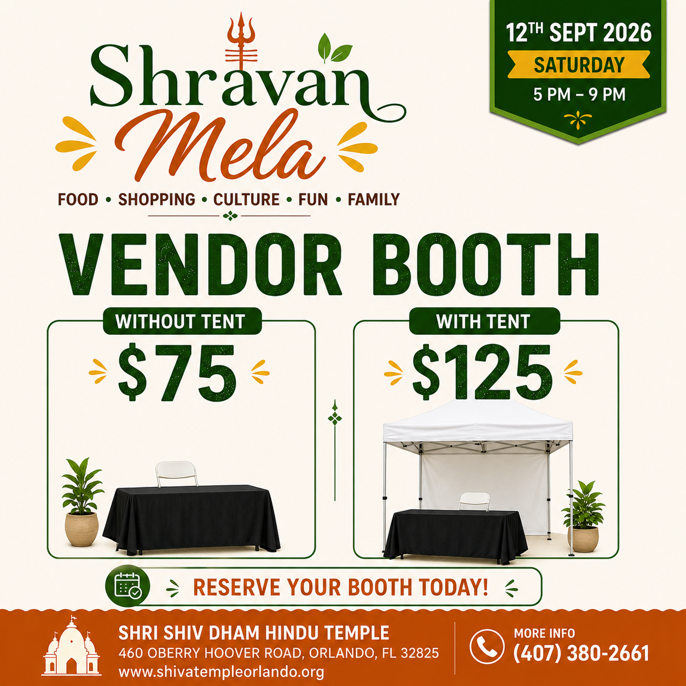

The temple welcomes vendors, food, merchandise, crafts, henna artists, and more, to take part in its larger community events, most notably the annual Shravan Mela. Vendor registration typically includes a booth space for the day, and the temple works with each vendor on space, power needs, and setup details ahead of time.

**See the opportunity firsthand:** faith, family, small business, and new opportunities at Shravan Mela.

  <iframe
    title="Inside Shravan Mela: Faith, Family, Small Business & New Opportunities at Shri Shiv Dham"
    src="https://www.youtube.com/embed/irIzmfhxN_Q"
    style="width:100%;aspect-ratio:16/9;border:0"
    loading="lazy"
    allow="accelerometer; autoplay; clipboard-write; encrypted-media; gyroscope; picture-in-picture; web-share"
    referrerpolicy="strict-origin-when-cross-origin"
    allowfullscreen
  ></iframe>

To register as a vendor for the Shravan Mela specifically, see [Shravan Mela Vendor Registration](/puja-bookings/shravan-mela-vendor-registration/) to reserve a booth.

For other temple events, or if you have questions before registering, [contact the temple office](/contact-us/) with details about what you'd like to offer.
